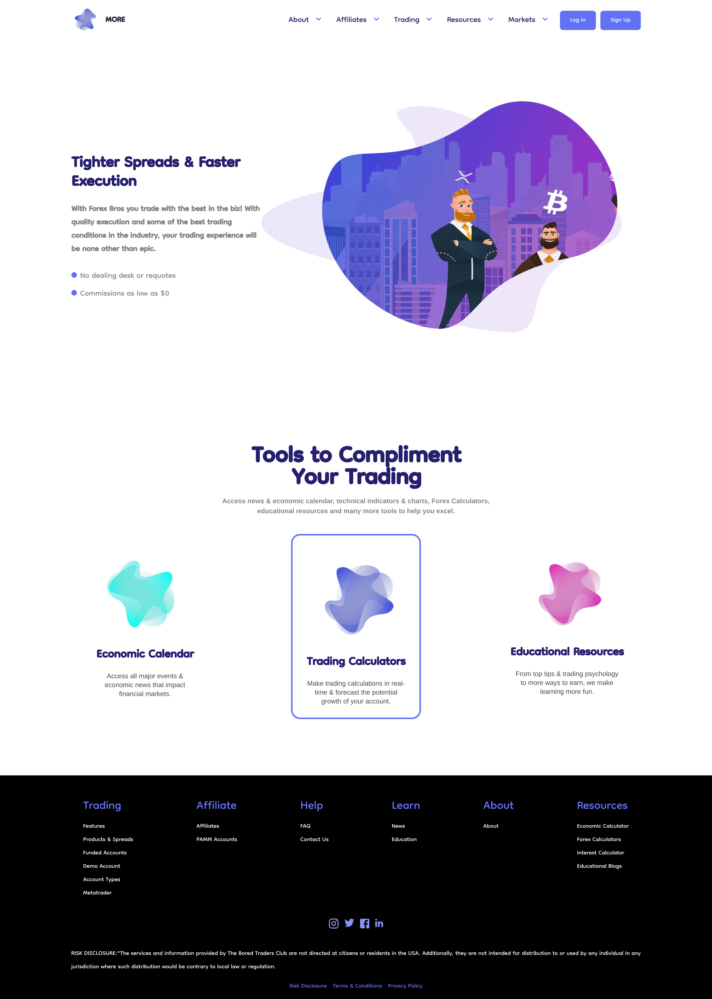
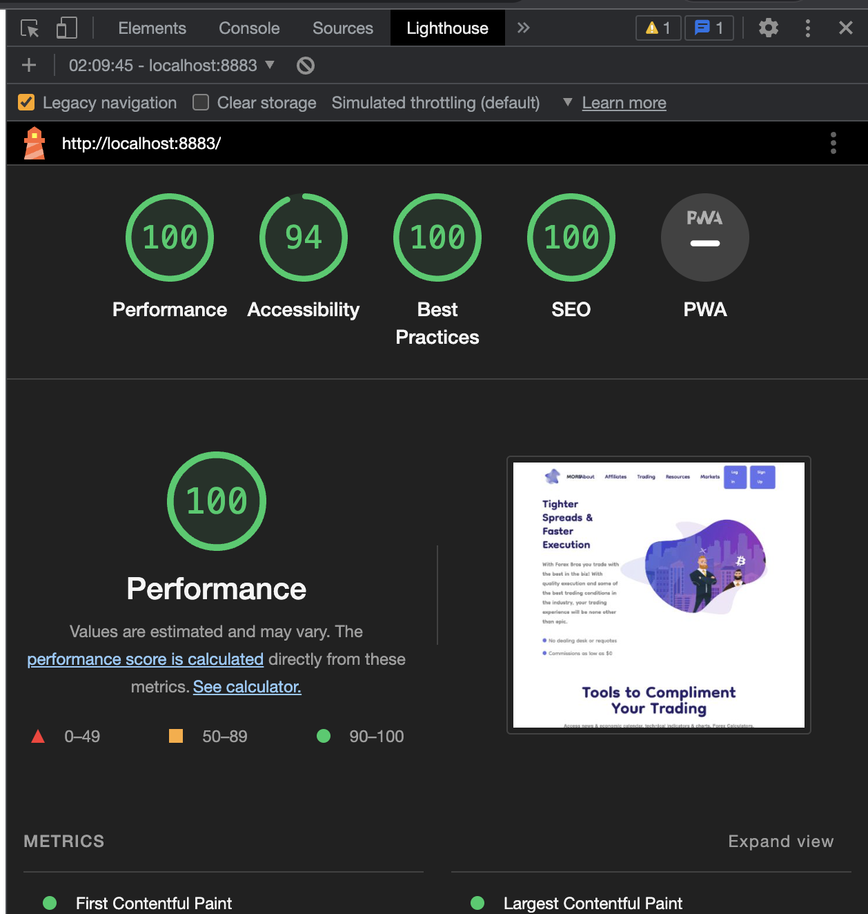
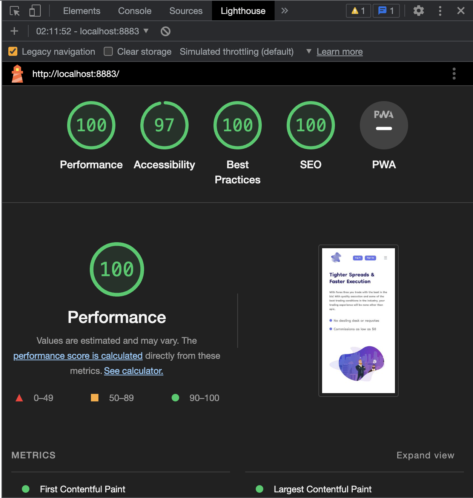

# Landing Page for More Trading Website

This project presents a landing page for a trading website, crafted with the combined power of WordPress and Tailwind CSS for a user-friendly and aesthetically pleasing experience.

## Admin Credentials

- Username: `admin`
- Password: `*jx5SQNfdmDZgkK%h686C#jG`

> **Important**: You can preview on the live staging instance of the theme at [https://staging4.asemhamdi.com/](https://staging4.asemhamdi.com/)

## Requirements

- Docker
- WordPress (latest version)
- PHP (version 8.2)
- MySQL (latest version)

## Technology Stack

- WordPress: Our chosen Content Management System.
- Tailwind CSS: A utility-first CSS framework used for custom designs.
- MySQL: Our database of choice.
- Docker: Our containerization platform.

## Features

1. **Fallback for Custom Fields:** The theme implements a fallback mechanism for custom fields, especially for images. If a custom field is not set or left empty in the admin panel, the field will default to using a predefined image located in the theme's assets directory. This ensures there are no blank or missing image issues in the live view.

2. **Reusable Sections Using Template Parts:** In order to maintain consistency across different pages and to increase code efficiency and maintainability, some sections of the pages are created as reusable blocks using WordPress's template part functionality. This allows for a modular design of page sections. Any changes made to the template part are reflected across all pages using that part.

3. **Advanced Custom Fields (ACF) Plugin:** This plugin is used extensively to create customizable fields for the theme. It enables admins to change images and content from the admin panel, enhancing the customization and usability of the website.

4. **Scroll Snap in "Our Tools" Section:** The "Our Tools" section uses a scroll snap feature for an intuitive user experience. This allows users to smoothly scroll through the different features of the website.

5. **Tailwind CSS for Custom Designs:** Tailwind CSS, a utility-first CSS framework, is used to create custom designs. This makes the website look unique and professionally crafted, providing a great user experience.

6. **Mobile-Responsive Design:** The website design is fully responsive, ensuring a seamless experience across various device screen sizes. This includes proper alignment and scaling of elements based on the viewport size.

7. **Performance-Optimized:** The theme is optimized for performance, resulting in fast page load times and a smooth user experience. This is achieved through efficient code practices and the use of performance optimization plugins like W3 Total Cache.

8. **SEO-Ready:** With the integration of the Yoast SEO plugin, the website is SEO-ready. This plugin helps to improve the website's SEO, increasing its visibility on search engine results pages.

## Installation

1. Start Docker containers using the following command:

    ```bash
    docker-compose up -d 
    ```

2. Install Tailwind CSS:

    ```bash
    npm install -D tailwindcss 
    ```

3. Initialize the Tailwind configuration:

    ```bash
    npx tailwindcss init -p 
    ```

4. Build the CSS:

    ```bash
    npm run build 
    ```

5. Watch the CSS files for changes:

    ```bash
    npm run watch 
    ```

6. Import the provided SQL database file into your MySQL instance.

7. Update the `wp-config.php` file in your WordPress installation to match the database name, user, and password.

    For example:

    ```php
    define( 'DB_NAME', 'your_database_name' );
    define( 'DB_USER', 'your_database_user' );
    define( 'DB_PASSWORD', 'your_database_password' );
    define( 'DB_HOST', 'localhost' );

    $table_prefix = 'wp_';

    ```

8. Run the following SQL commands to update your site URLs in the database:

    ```sql
    UPDATE wp_options SET option_value = replace(option_value, 'http://localhost:8883', 'http://www.newurl') WHERE option_name = 'home' OR option_name = 'siteurl';
    UPDATE wp_posts SET post_content = replace(post_content, 'http://localhost:8883', 'http://www.newurl');
    UPDATE wp_postmeta SET meta_value = replace(meta_value,'http://localhost:8883','http://www.newurl');
    UPDATE wp_posts SET guid = REPLACE (guid, 'http://localhost:8883', 'http://www.newurl');

    ```

    - Replace `'http://www.oldurl'` and `'http://www.newurl'` with your old and new URLs, respectively.
    - Login using [#Admin Credentials](#admin-credentials)

9. Add the `wp-content` directory to your WordPress installation.
    - or Install the theme and plugins manually.
10. Activate the theme and plugins.
11. make sure the Uploads folder is added to the wp-content folder.
12. **Important** Make sure the Footer Mneus are set to their Theme Locations as due to the export/import process they might not be set automatically.
    - Easy to set
    - Go to Appearance > Menus
    - Select Manage Locations
    - Set the following Menus to their respective locations:

        ```php
            'header-menu' => 'Header Menu',
            'trading-menu' => 'Trading',
            'affiliate-menu' => 'Affiliate',
            'help-menu' => 'Help',
            'learn-menu' => 'Learn Menu',
            'about-menu' => 'About Menu',
            'resources-menu' => 'Resources Menu',
            'legal-menu' => 'Legal Menu',
        ```

13. Access your WordPress website and confirm that all contents and configurations are correct.

## Design

- Total Width is 1920px.
- The Container width is 1536px.
- The container screen percentage is 80% of the viewport.
- The container screen percentage is 90% of the viewport on mobile devices.

## Essential Plugins and Extensions

- [Wordfence](https://wordpress.org/plugins/wordfence/)
- [Advanced Custom Fields](https://wordpress.org/plugins/advanced-custom-fields/) (Must Have)
- [W3 Total Cache](https://wordpress.org/plugins/w3-total-cache/)
- [Akismet Anti-Spam](https://wordpress.org/plugins/akismet/)
- [Yoast SEO](https://wordpress.org/plugins/wordpress-seo/)
- [Total Upkeep](https://wordpress.org/plugins/total-upkeep/)
- [Image Service](https://www.boldgrid.com/w3-total-cache/)

## Usage

- The Advanced Custom Fields (ACF) plugin is used to create custom fields for all images in the theme, allowing the user to easily change the images from the admin panel.
- The "Our Tools" section uses scroll snap for an intuitive user experience.
- Please Activate the plugins, clear the cache.

## Screenshots

- Desktop View:

  

- Mobile View:

  

## Performance Scores

We have tested our website's performance using the Lighthouse extension in Chrome, and have achieved the following results:

- Desktop Performance:
  - Performance score: 
  - Accessibility score: 
  - Best Practices score: 
  - SEO score: 
  
    

- Mobile Performance:
  - Performance score: 
  - Accessibility score: 
  - Best Practices score: 
  - SEO score: 

    

*Please note: The accessibility score is not 100 due to a lower contrast ratio for the paragraph color in the "Our Tools" section. This is an aesthetic design choice.*
